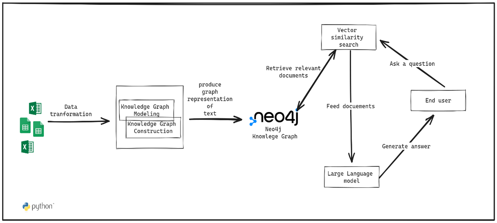

# Enhancing Package Recommendation in CRAN Open Source Ecosystem with "Cran2Graph"

## Context:

The open source ecosystem, particularly Comprehensive R Archive Network (CRAN) has grown substantially, making it challenging for users to identify relevant R packages and understand the relationships between authors, package, and maintainers. Traditional recommendation systems are limited in their ability to provide such detailed information. "Cran2Graph" proposes to address this issue by leveraging knowledge graphs and large language models.

## Research gap

R users face a daunting challenge in discovering relevant CRAN packages and relationships due to the vast and diverse nature of the ecosystem. Existing recommendations systems often rely on simplistic methods, such as keyword matching and basic metadata analysis, which fails to capture the semantic intricacies of package functionalities and dependencies.

## Objectives:

• To design and develop Cran2Graph, a system that leverages knowledge graphs and large language models to enhance open-source package. • To evaluate the effectiveness of Cran2Graph in answering user questions about the authors relationships with packages, package maintainers. • To establish comprehensive evaluation metrics for assessing the quality of package recommendations.

## Methodological approach:

The research will involve the design and development of the "Cran2Graph" recommendation system, integrating neo4j for knowledge graph representation and large language models for semenatic understanding.

## Expected results:

The expected results include the successful implementation of the Cran2Graph system, providing users with context-aware and semantically enriched package recommendations. Additionally, the system is expected to effectively answer user questions about authors relationship with packages.

## Contributions:

This research project contributes to the enhancement of open source package recommendation in the Cran ecosystem by introducing "Cran2Graph", a recommendation system. It provides a methodology for integrating knowledge graphs and large language models into recommendation systems, with implications beyond the R ecosystem. The methodology used would improve answering detailed questions about open source package relationships.

#### References
- https://towardsdatascience.com/integrate-llm-workflows-with-knowledge-graph-using-neo4j-and-apoc-27ef7e9900a2

# TO do

Required to isntall `nmslib`

License <https://opensource.org/licenses/>

Experiencing difficult split the domain, institution from the maintainer column why [erch\@mathematik.uni-marburg.de](mailto:erch@mathematik.uni-marburg.de){.email} mathematik Florian [Lerchlerch\@mathematik.uni-marburg.de](mailto:Lerchlerch@mathematik.uni-marburg.de){.email}\>
